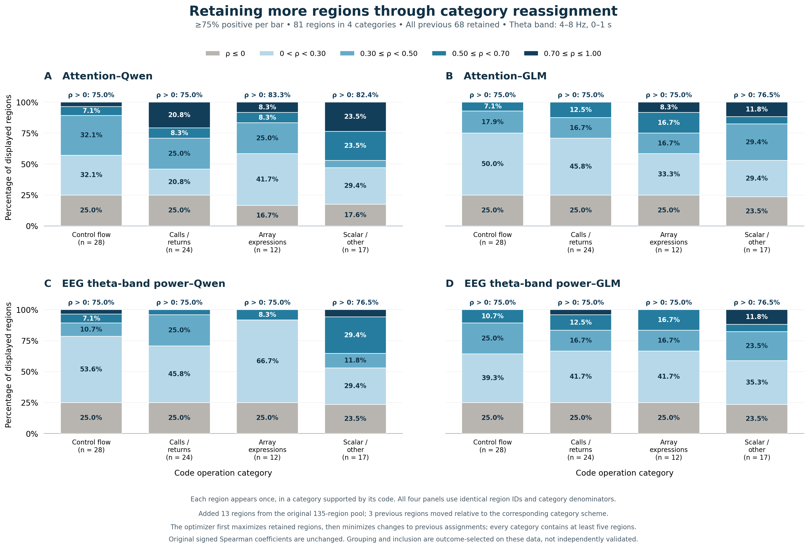

# CogAdapt

Selected review artifact for **CogAdapt: Cognitive-Informed Sparse Adaptation of
LLM Models for Code Generation**.

CogAdapt uses offline human code-reading evidence to guide task/token loss
weights and task-dependent adaptation of MoE models. Downstream fine-tuning uses
ordinary coding instructions and reference solutions. **No EEG or gaze input is
required at inference.**

This repository intentionally contains only important implementation excerpts,
aggregate paper results, and lightweight inspection tools. **It is not an
end-to-end reproduction package.** It does not contain training launchers, model
weights, raw human recordings, benchmark prompts/solutions/tests, or the original
workspace history.

## What is included

| Paper component | Review code / result |
|---|---|
| Task-dependent block ranking and selection, Section 4.3 | [Qwen selector](cogadapt/selection_qwen.py), [GLM selector](cogadapt/selection_glm.py), [six real cached examples](results/rq3/selection_examples.json) |
| Task/token emphasis, Section 4.4 | [Weighting routines](cogadapt/weighting.py) |
| Weighted causal loss, gradient eligibility, inference activation | [Selected PyTorch routines](cogadapt/torch_helpers.py) |
| Spearman alignment and length controls | [Alignment routines](cogadapt/alignment.py) |
| CKA baseline formula | [linear_cka](cogadapt/torch_helpers.py) |
| RQ1, Figure 4 | [Retained four-category figure](figures/region_retention/figure4_retained_four_categories.png), [full numerical data](results/rq1), [calculation and reproduction](docs/RQ1_REGION_ALIGNMENT.md) |
| RQ2, Figure 5 | [Complete depth–time correlation maps](results/rq2/theta_depth_time_cells.csv) |
| RQ2, Figure 6 | [32 program aggregates](results/rq2/program_values.csv), [correlations](results/rq2/program_correlations.csv) |
| RQ3, Table 2 | [Accuracy table](results/rq3/table2_accuracy.csv), [individual paper runs](results/rq3/paper_runs.csv) |
| RQ3, Table 3 | [Training-efficiency table](results/rq3/table3_training_efficiency.csv) |
| Paired correctness checks | [Binary task outcomes](results/rq3/task_outcomes.csv), [saved paired statistics](results/rq3/paired_dynamic_vs_regular.csv) |
| Settings and provenance | [Portable settings](configs/paper_settings.json), [source-excerpt manifest](provenance/code_excerpts.json), [result manifest](provenance/results_manifest.json) |

Most core routines are verbatim extracts of the implementation used in the
experiments. Their source filenames, symbols, line numbers, and hashes are
recorded. Standalone task/token-weight wrappers, verification, and plotting
helpers were added for this limited review release; they are not represented as
the original training runner.

## Method at a glance

~~~text
OFFLINE HUMAN STUDY
Shared Java code + EEG/gaze -> difficulty, token-category, and depth priors

DOWNSTREAM TRAINING
Coding prompt + reference -> frozen-model features -> cached block mask
Reference + human-informed weights -> coding loss -> selected parameter gradients

DEPLOYMENT
New coding prompt -> prompt-only block mask -> enabled learned updates -> solution
~~~

Blocks, experts, and adapters are different objects. Qwen has 48 transformer
blocks and GLM has 47; each routed block contains multiple experts. Selected
blocks contain attention LoRA adapters and trainable router gate weights.
Pretrained expert feed-forward weights remain frozen.

During training, masks restrict parameter-gradient eligibility; all installed
adaptations still participate in the forward pass. An optimizer step can update
the union of masks across its eight accumulated microsteps. At inference,
nonselected LoRA contributions are disabled and nonselected routers restored to
base. **The full transformer backbone still executes.**

See [implementation and interpretation notes](docs/IMPLEMENTATION_NOTES.md) for
the distinctions between the manuscript's conceptual descriptions and the
recorded feature definitions.

## Paper accuracy

Execution pass@1 (%); Random-K6 is mean ± sample standard deviation across the
three masks used in the paper. Each individual condition uses its first complete
generation pass.

| Model | Benchmark | Regular FT | Random-K6 | CKA-K6 | CogAdapt |
|---|---|---:|---:|---:|---:|
| Qwen | LiveCodeBench | 18.86 | 22.86 ± 0.57 | 24.57 | 29.71 |
| Qwen | BigCodeBench | 36.36 | 34.39 ± 1.14 | 32.73 | 37.73 |
| GLM | LiveCodeBench | 17.71 | 20.00 ± 1.51 | 21.14 | 24.00 |
| GLM | BigCodeBench | 28.64 | 30.76 ± 0.95 | 28.64 | 31.82 |

Random-mask cohorts are explicit:

- Qwen/LCB, Qwen/BCB, and GLM/LCB: **90317, 90318, 90319**.
- GLM/BCB: **90320, 90321, 90322**.
- Training seed remains **90317** for every run. Mask-seed variation is not
  training-seed replication.

Only these paper cohorts are included. This snapshot is not a complete archive
of every experiment or random mask explored during development.

Regular FT is the matched **all-block attention-LoRA/router** control, not
full-parameter tuning of the entire model. Random-K6 and CKA-K6 retain the
human-informed loss weights. Dynamic versus Regular FT therefore evaluates the
combined selection-and-weighting recipe, not EEG's isolated causal contribution.

The paired task-bootstrap intervals exclude zero for the LiveCodeBench gains
(Qwen +10.86 and GLM +6.29 percentage points), but include zero for BigCodeBench.
Historical configuration selection and single-seed training limit confirmatory
interpretation. See the [paired statistics](results/rq3/paired_dynamic_vs_regular.csv).

## Training selectivity

| Model / benchmark | Mean eligible blocks | Mean eligible parameters | Installed adaptation pool | Eligibility reduction |
|---|---:|---:|---:|---:|
| Qwen / LCB | 6.25 / 48 | 3.382M | 25.952M | 86.97% |
| Qwen / BCB | 6.14 / 48 | 3.319M | 25.952M | 87.21% |
| GLM / LCB | 6.09 / 47 | 3.486M | 27.061M | 87.12% |
| GLM / BCB | 6.55 / 47 | 3.733M | 27.061M | 86.21% |

These are per-unique-training-example gradient-eligibility counts, not reductions
in model size, installed adapter capacity, or total computation. Table 3's
instrumented training replicas show 2.53–5.87% lower training-loop wall time and
2.12–4.55% lower measured GPU energy. Offline preprocessing is outside that
measurement. The current method does **not** provide an inference-speed advantage.

## Quick inspection — CPU only, no model download

Use Python 3.11 or newer:

~~~bash
python -m venv .venv
source .venv/bin/activate
python -m pip install -r requirements.txt
python scripts/verify_artifact.py
python -m unittest discover -s tests -v
python scripts/plot_review_figures.py
~~~

The verifier recomputes table means/sample SDs, checks the binary outcomes,
recalculates aggregate correlations, reproduces the six cached block masks, and
validates exported-file and source-excerpt hashes. It does not train or evaluate
an LLM. Tests use tiny synthetic arrays/tensors solely as unit-test fixtures.

The plotting script draws the Table 2 accuracy summary, Figure 4 percentage
bars, Figure 5 depth–time maps, and Figure 6 program scatter triplet. The selected
Figure 4 PNG/PDF is included in the repository; other renderings are generated
locally. Figure 6's trend lines are descriptive fits, not confidence intervals.

## RQ1: attention and EEG alignment within code regions

[PDF](figures/region_retention/figure4_retained_four_categories.pdf) ·
[Full numerical data](results/rq1) ·
[Signal definitions, selection, and reproduction](docs/RQ1_REGION_ALIGNMENT.md)

The four panels compare **Attention–Qwen**, **Attention–GLM**, **EEG theta-band
power–Qwen**, and **EEG theta-band power–GLM**. Each bar shows the percentage of
retained code regions in a correlation band. The four categories contain 28,
24, 12, and 17 regions, respectively, for 81 distinct regions.

Each coefficient is Spearman correlation across matched tokens within a source
line. The model signal is the equal-weight mean of standardized hidden-state
shift, MoE write, and residual integration. Theta uses 4–8 Hz power change over
0–1 s after a regression landing fixation.

The export includes all 245 original regions, all 1,817 matched token inputs,
the selected 81 regions and their 733 token inputs, exact bar counts, and
exclusion reasons. This replaces the previous RQ1 aggregate table and heatmap.
The selected regions and category assignments were optimized to make every bar
at least 75% positive; this is an exploratory, outcome-selected display, not an
independent significance result. The full pool remains available for inspection.

Verify every coefficient and redraw this figure without the original workspace:

~~~bash
python scripts/reproduce_four_category_figure.py
python scripts/plot_review_figures.py --figure 4
~~~

The verifier checks 732 coefficients across 183 estimable regions and all 80 bar
segments. Redrawing preserves the published region set and category assignments.

For the optional PyTorch loss/masking/CKA excerpts and CPU unit tests:

~~~bash
python -m pip install -r requirements-torch.txt
python -m unittest discover -s tests -v
~~~

PyTorch is not required for checking results or plotting. Without it, the
PyTorch-specific tests are explicitly skipped. The historical model-experiment
software versions are recorded separately in the settings file; these lightweight
review dependencies are not a claim to reproduce that GPU environment.

